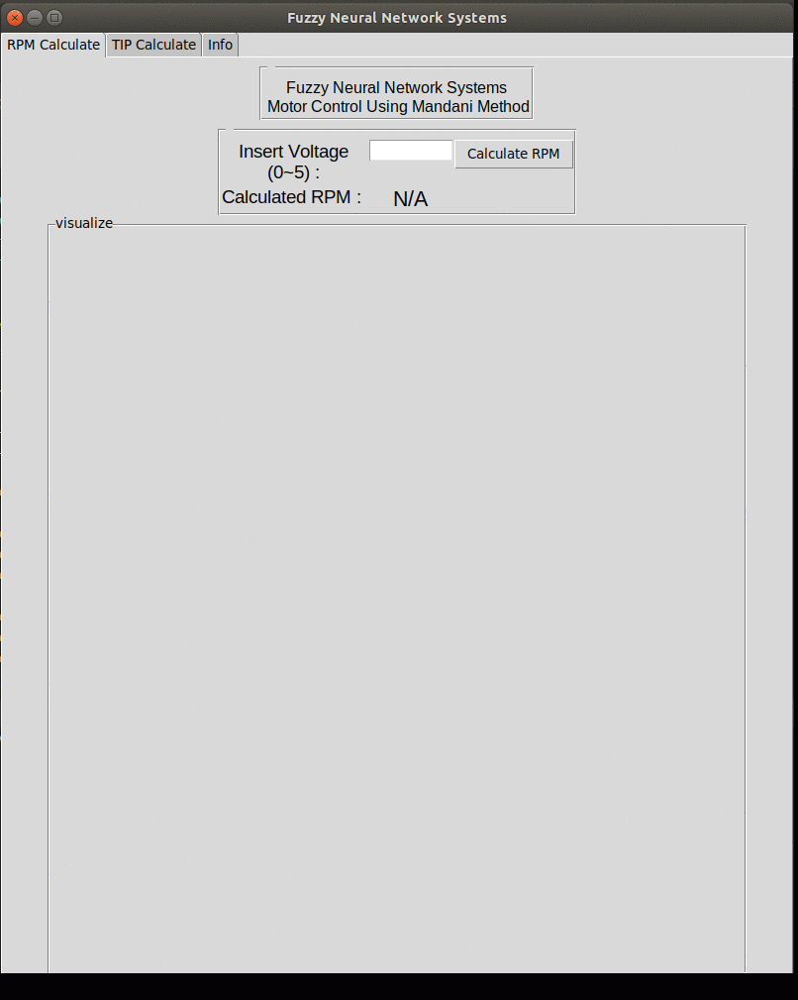

# Fuzzy Inference system


[](https://travis-ci.org/joemccann/dillinger)

This project we implement two common and simple problem fuzzy inference using python.

  - DC motor control using Mandani method
  - Restaurant Tips Calculation using Mandani method


# Features!

  - Python TK based GUI
  - Visualize The membership functions 

# Dependencies 

  - Python 3
  - MatplotLib
  - Opencv
  - scikit-fuzzy


### Installation
Install the dependencies 

```sh
$ pip install -r requirements.txt
```

For testing the code...

```sh
$ python main.py
```


License
----

MIT


**Free Software**
# Acknowledgement
This Demo is developed as a class project "Fuzzy Neural Network Systems" Gachon University, South Korea

